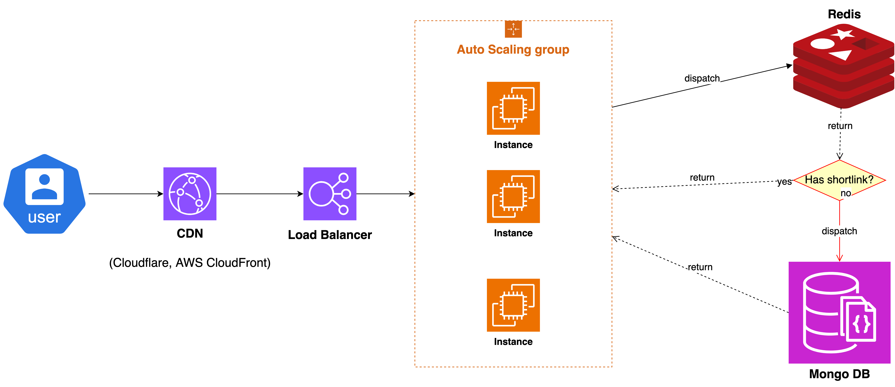

# Shortlink
[](https://github.com/bos-hieu/shortlink/actions/workflows/testing.yml)
[](https://codecov.io/gh/bos-hieu/shortlink)

This is a simple shortlink service is built with [Gin Gonic](https://github.com/gin-gonic/gin) framework, [MongoDB](https://www.mongodb.com/docs/drivers/go/current/quick-start/) and [Redis](https://github.com/redis/go-redis).

## Approach
(The implementation of this approach can be found in this [github repository](github.com/bos-hieu/shortlink)).

From the requirements, we can see that the shortlink service needs to be able to redirect users based on their country and language. To achieve this, we can use the following approach:
- Store the shortlink, country-specific destination URL, language-specific destination URL, and default destination URL in a database.
- When a user enters a shortlink in the browser, the service will check the user's country and language and redirect the user to the appropriate destination URL.

### Here is a high-level overview of the logic for the shortlink redirector:
1. When a shortlink is created, the user can specify the country-specific destination URL, language-specific destination URL, and default destination URL.
2. When a user enters a shortlink in the browser, the flow is as follows:
   - Step 1: The user enters a short link in their browser, which sends a request to the shortlink service, for example: `http://shortlink.xyz/abc123`. The request from the user's browser will include the `Accept-Language` header, which contains the user's preferred language.
   - Step 2: The request is first routed through the CDN service, which detects the user's country based on their IP address.
   - Step 3:The CDN services then forwards the request to a load balancer, which distributes the request to one of the shortlink service instances located in a auto-scaling group.
   - Step 4:The shortlink service receives the request and extracts the shortlink identifier, in this case `abc123`.
   - Step 5: The shortlink service first checks Redis cache to see if the shortlink is cached. If the shortlink is cached, the service retrieves the destination URL from the cache and redirects the user to the destination URL.
   - Step 6: If the shortlink is not cached, the service queries the MongoDB database to get the shortlink document.
   - Step 7: The service then check the user's country and language and redirect the user to appropriate destination URL. 
   - Step 8: If the service cannot find appropriate destination URL, it will redirect the user to a not found page.
   
   -> <i>The service also caches the shortlink and destination URL in Redis to improve the performance of the service.</i> 

   -> <i>The response is then cached by the CDN service to reduce the latency of the service.</i>

   


### To implement this logic, we can use the following libraries and systems:
- A CDN service, such as Cloudflare or AWS CloudFront, to detect the user's country based on their IP address.
- For the language detection, we can get the user's language from the browser settings by using the 'Accept-Language' header, which is sent by the browser with each HTTP request.
- A database, we should use the no SQL database like MongoDB or Amazon DynamoDB to store data, because the system is read-heavy and requires fast read access to the data.
- A caching system, such as Redis, to cache the read data and improve the performance of the service by reducing the number of database queries. We can also use the CDN service to cache the response and reduce the latency of the service.
- To build the service, in the backend, we can use the Gin Gonic framework, which is a lightweight web framework for building APIs in Golang programming language.
- For the frontend, we can use a simple HTML and JavaScript to create the user interface for creating and using the shortlink.
- We can also use a CI/CD system, such as GitHub Actions, Terraform, GitLab runner, AWS CodePipeline, to automate the deployment of the service and ensure that the code is tested and deployed in a consistent and reliable manner.
- We can also use a monitoring system, such as Prometheus, Grafana, AWS CloudWatch, Datadog, New Relic, to monitor, alert, and audit the service and ensure that it is running smoothly and efficiently.
- In terms of scalability and high availability, we can deploy the service on a cloud provider, such as AWS, Google Cloud, Azure, and use auto-scaling, load balancing, and multi-region deployment to ensure that the service can handle a large number of users and is resilient to failures.

### To data model for the shortlink service can be as follows:
```go
type ShortLink struct {
  // ID is the mongo object ID
  ID primitive.ObjectID `bson:"_id"`

  // ShortLink is the short link identifier from the default URL
  // This field will be indexed by unique to increase read performance.
  ShortLink string `bson:"short_link"`

  // DefaultDestinationURL is the default URL to redirect to if no other rules are matched
  // This field will be indexed by unique to increase read performance.
  DefaultDestinationURL string `bson:"default_destination_url"`

  // DestinationURLsByCountry is a map of country codes to destination URLs
  DestinationURLsByCountry map[string]string `bson:"destination_urls_by_country"`

  // DestinationURLsByLanguageCountry is a map of language codes to destination URLs
  // The language codes are in ISO 639-1 format, for example: en-US, en-GB, fr-FR, etc.
  DestinationURLsByLanguageCountry map[string]string `bson:"destination_urls_by_language_country"`
}
```
This data model allows us to store the shortlink, default destination URL, country-specific destination URLs, and language-specific destination URLs in a single document in the database, in this case, MongoDB.

### To the function to convert the destination URL to a unique shortlink
We can use the google uuid library to generate a unique value, which is 36 characters long. 
After that, we can encode the 16 bytes value to base62 to get a shortlink value that is unique and with a length of about 22 characters.
This approach is more efficient than using a hash function to generate a shortlink because it guarantees that the shortlink is unique and prevents collisions, which can occur when using a hash function.
```go
// Define the Base62 character set
const base62Charset = "0123456789ABCDEFGHIJKLMNOPQRSTUVWXYZabcdefghijklmnopqrstuvwxyz"

// GenUniqueValue generates a unique value
func GenUniqueValue() string {
	// Generate a new UUID
	uuidObj := uuid.New()

	// Convert the UUID to a big.Int
	number := new(big.Int)
	number.SetBytes(uuidObj[:])

	return Base62EncodeBigInt(number)
}

// Base62EncodeBigInt encodes a big.Int to a Base62 string
func Base62EncodeBigInt(number *big.Int) string {
	// compare number with 0
	zero := big.NewInt(0)
	if number.Cmp(zero) == 0 {
		return string(base62Charset[0])
	}

	var result string
	base := big.NewInt(int64(len(base62Charset)))
	for number.Cmp(zero) > 0 {
		// mod is an empty big.Int, which holds the remainder of the division operation (number % base)
		mod := new(big.Int)

		// number = number / base, and mod = number % base
		number.DivMod(number, base, mod)

		// prepend the character at the index of the remainder to the result
		result = string(base62Charset[mod.Int64()]) + result
	}
	return result
}
```

### Summary
Overall, the shortlink service can be implemented using the above approach and technologies to provide a fast, reliable, and scalable service that can handle a large number of users and redirect them to the appropriate destination URL.